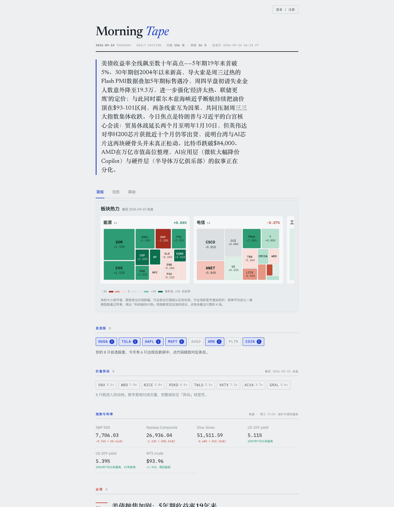

# Taurient Lite

**English** · [中文](README.zh-CN.md)

[](https://taurient-lite-backend.onrender.com)


**An automated pre-market news brief for US equities, macro and AI/tech.**
Every trading day at 6:00 AM PT it scans global financial and tech news, merges
duplicate stories, ranks them into three tiers, explains why each one matters,
and publishes a web dashboard plus a Markdown archive.

It's inspired by Taurient, the in-house tool at the Australian hedge fund
Minotaur Capital that uses several LLMs to scan about 35,000 news articles a
week for investment ideas. Taurient Lite covers only the information-compression
part of that. It doesn't pick stocks or give advice. Its job is to tell you what
you need to know before the open in a few minutes of reading.

**→ Live brief: [taurient-lite-backend.onrender.com](https://taurient-lite-backend.onrender.com)**
<sub>(The brief itself is written in Chinese. Free-tier hosting, so the first load may take a few seconds.)</sub>



## What you get every morning

- **Three-tier news:** *must read*, *worth knowing* and *background noise*. Each
  item shows its publish date and a freshness badge.
- **Deep metadata on top stories:** an asset-impact matrix, a cross-source
  comparison and a timeline of how the story developed.
- **Sector heatmap:** one treemap per GICS sector. Tile size is market cap, tile
  color is the day's move, and sectors are ordered strongest to weakest. It shows
  where money is flowing today. A top-gainers list would mostly show micro-caps
  and single-stock news, while a treemap gives large companies the space they
  carry in the market.
- **Momentum scanner:** about 2,500 liquid US stocks are scanned each morning and
  put into four stages by how close each one is to where its move started (see
  below).
- **Watchlist panel:** tickers that appear in today's news are highlighted and
  link to their stories. Signed-in users can keep their own watchlist and filter
  the brief down to it.
- **Stock pages:** zoomable candlestick charts with draggable trendlines, company
  profile, key stats, analyst ratings, earnings and a raw headline feed.
- **Calendar tab:** upcoming events on a rolling weekly grid. Events without a
  confirmed date go in a separate "TBD" list instead of getting a made-up date.
- **Indices and rates snapshot:** S&P 500, Nasdaq, Dow, 10Y/30Y yields, WTI crude.

## How it works

```
GitHub Actions ──► market data (Yahoo, FINRA, full-market momentum scan) ──► data/*.json
                                                                                  │
Claude Code routine ──► scan news, dedupe, tier, write "why it matters" ──► briefs/YYYY-MM-DD.json   ← single source of truth
                                                                                  │
taurient_lite/ (pure-stdlib renderer) ──► validate JSON ──► HTML dashboard + Markdown archive
                                                                                  │
backend/ (FastAPI on Render) ──► serves the latest brief with live quotes, stock pages, accounts
```

- **Data and presentation are kept apart.** The daily JSON is the only source of
  truth, and the web page and the Markdown archive are both generated from it.
  Restyling touches only `theme.py`. Changing news coverage touches only
  `config.json`.
- **The rendering core has zero third-party dependencies.** Dependencies flow
  strictly downward: `schema` → `components` → renderers → `pipeline`, so each
  layer can be tested on its own.
- **Model judgment runs once a day. Numbers are always fresh.** News triage needs
  an LLM, so it's a daily batch job. Prices don't, so the backend fetches live
  quotes and heatmap data (cached for 5 minutes). If a fetch fails, it falls back
  to the archived numbers and never returns a 502.
- **Hard numbers come from primary sources:** Fed dates from federalreserve.gov,
  earnings dates and filings from SEC EDGAR, short interest from FINRA.

More detail is in [docs/architecture.md](docs/architecture.md) and
[docs/frontend-architecture.md](docs/frontend-architecture.md) (in Chinese).

## Momentum scanner, and an honest backtest

News is a lagging signal. By the time a catalyst makes the headlines, much of the
move has usually happened already. The scanner reads only price and volume
(OHLCV) and asks how far into its move a stock is:

| Stage | Meaning |
|---|---|
| **Early** | Broke a 50-day high within the last 3 days, on volume ≥ 2.5× the 20-day median |
| **Continuation** | Within two weeks of the breakout. The trend holds, but the best entry has passed |
| **Base** | Not broken out yet, range tightening. A watchlist candidate |
| **Extended** | > 35% above the 20-day MA, or > 10 days since the breakout, or doubled off its base |

**This is not a trading signal.** The full backtest covered 2,515 liquid US stocks
over two years and **5,090 early-stage signals**:

- The win rate is barely better than a coin flip (about 51.5%). Expected value is
  +1.79% over 30 days, but the median is only +0.49%. The returns come almost
  entirely from a few big winners in the tail.
- The idea that the earliest signals are the best ones was **disproved by the
  data**: the "earliest" quartile averaged −0.19% over 20 days, and the "most
  extended" quartile averaged +1.92%.
- Take-profit rules make the win rate look better and the returns worse. A +5%
  take-profit raises the win rate to 73.6% but cuts expected value from +1.79% to
  +0.41%.
- Caveats: the test period (2024–2026) was mostly a bull market, the sample has
  survivorship bias, and the numbers are before transaction costs.

The stages are there to state facts about where a stock is in its move, not to
predict returns. What the scanner gives you is **time**. It flagged BE as early
stage at $23.92 on 2025-06-30, months before it became a headline. The stock is
now around $258. The scanner didn't predict that. It saw the move in price and
volume before it reached the news. The full tables are in
[README.zh-CN.md](README.zh-CN.md#价量异动扫描).

## Quick start

```bash
git clone https://github.com/400-tang/taurient-lite.git
cd taurient-lite

# Re-render an existing brief (no dependencies needed)
python3 render.py 2026-09-18          # → site/index.html + briefs/2026-09-18.md

# Run the test suite (standard library only)
python3 -m unittest discover -s tests -t .

# Run the web backend locally
pip install -r backend/requirements.txt
uvicorn backend.server:app --reload   # → http://127.0.0.1:8000
```

Other entry points:

```bash
python3 scan_momentum.py                     # daily momentum scan over data/universe.txt
python3 scan_momentum.py --refresh-universe  # rebuild the liquid-stock universe (weekly)
python3 apply_momentum.py <date>             # merge scan results into a day's brief
python3 fetch_sectors.py                     # sector map + market caps for the heatmap
python3 fetch_short_interest.py              # official FINRA short interest
python3 import_watchlist.py                  # import a TradingView watchlist export
```

To generate a full brief with Claude Code: `claude "Generate today's brief following RUNBOOK.md"`.

## Project layout

```
taurient-lite/
├── RUNBOOK.md             Daily procedure the scheduled agent follows
├── config.json            Coverage, item targets, freshness limits, watchlist
├── taurient_lite/         Rendering pipeline (zero third-party deps)
│   ├── schema.py          Data model and validation
│   ├── components/        UI components
│   ├── theme.py           Design tokens and stylesheet (light and dark)
│   ├── momentum.py        Momentum stage logic (pure functions)
│   ├── treemap.py         Treemap layout (pure geometry)
│   └── ...
├── backend/               FastAPI service on Render (live quotes, stock pages, Supabase auth)
├── tests/                 381 tests, standard library only
├── briefs/                Daily JSON (source of truth) and Markdown archive
├── data/                  Market snapshots produced by GitHub Actions
└── .github/workflows/     Scheduled market-snapshot and momentum-scan jobs
```

## Automation

- **Claude Code cloud routine:** runs on weekdays. The cron is `0 13,14 * * 1-5`
  (UTC), and a time gate in the prompt makes only the run after 6:00 AM Pacific
  do any work. That handles daylight-saving time without editing the cron twice a
  year.
- **GitHub Actions:** fetches market snapshots and runs the momentum scan before
  the routine starts. The routine's sandbox can't reach Yahoo but can reach
  GitHub, so the Actions runner fetches the data and commits it to the repo, and
  the routine picks it up when it clones.
- **Render:** deploys `backend/` from `render.yaml`
  (New → Blueprint in the Render dashboard).

## Design

The layout is modeled on a morning newsletter rather than a trading terminal: a
single column about 65 characters wide, Newsreader for headlines, IBM Plex Sans
for body text and IBM Plex Mono for every number. Cobalt blue is used for
structure and interaction only. Red and green are reserved for market direction.
The up/down colors were checked for color-blind readability. In dark mode, arrows,
signed values and intensity bars mark direction as well as color.

## Disclaimer

This is a news-summary tool, not investment advice. It makes no buy or sell
recommendations and no price predictions. Every number in a brief has to trace
back to a cited source, and numbers that can't be verified are left out.
